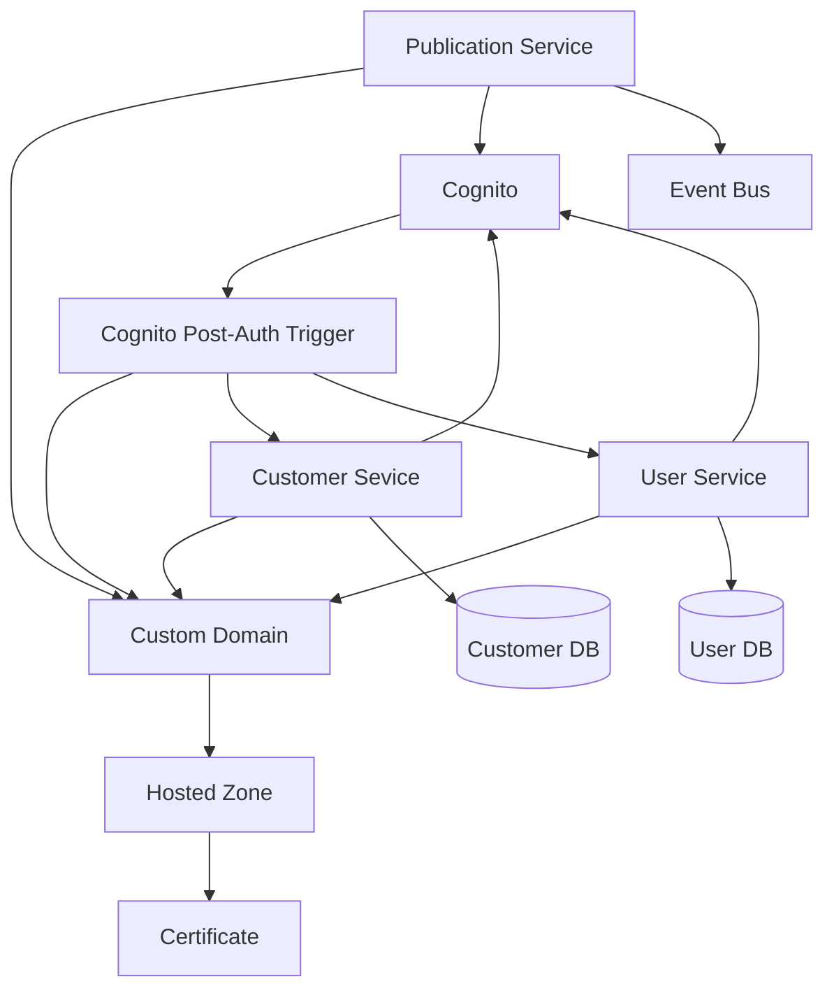

## Graph with Cognito Trigger

Showing cyclic dependency between Cognito, Cognito Trigger and Customer and User Service.

This is the current solution.

```mermaid
graph TD
    PS[Publication Service] --> CD[Custom Domain]
    CS[Customer Sevice] --> CD
    US[User Service] --> CD
    CT[Cognito Post-Auth Trigger] --> CD
    CS --> CDB[(Customer DB)]
    US --> UDB[(User DB)]
    DNS[Hosted Zone] --> CERT[Certificate]
    CD --> DNS
    COG[Cognito] --> CT
    PS --> COG
    US --> COG
    CS --> COG
    CT --> CS
    CT --> US
    PS --> EB[Event Bus]
```