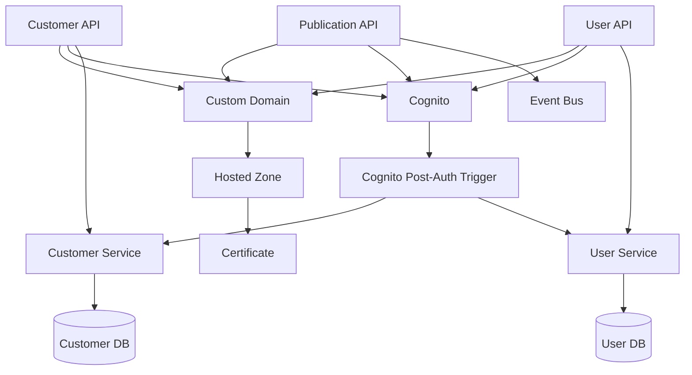

## Graph with separate web API and internal API

Showing possible new dependency graph where User API (web API) is separate from User Service (internal API).

Possible new solution.

```mermaid
graph TD
    PS[Publication API] --> CD[Custom Domain]
    CS[Customer API] --> CD
    US[User API] --> CD
    CSI --> CDB[(Customer DB)]
    USI --> UDB[(User DB)]
    DNS[Hosted Zone] --> CERT[Certificate]
    CD --> DNS
    COG[Cognito] --> CT[Cognito Post-Auth Trigger]
    PS --> COG
    US --> COG
    CS --> COG
    CS --> CSI
    US --> USI
    CT --> CSI[Customer Service]
    CT --> USI[User Service]
    PS --> EB[Event Bus]
```