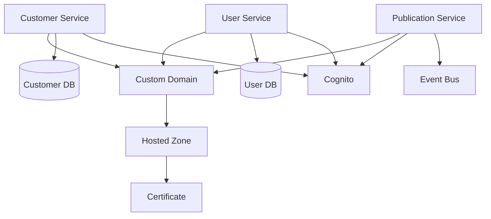

## Graph with Cognito without trigger

Showing possible new dependency graph where Cognito is not using a trigger to create the access token. Requires the client
 to possible look up extra claims from the /userinfo endpoint or similar.

Possible new solution.

